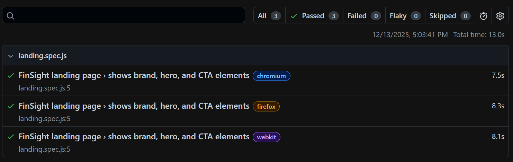

# FinSight – Personal Finance Dashboard

FinSight is a full-stack personal finance dashboard that helps users track income, expenses, categories, net worth, and financial trends over time.  
The application is built using **React (Vite)** on the frontend, **Express + MongoDB** on the backend, secured with **Clerk authentication**, and deployed on **Google Cloud Run** (API) and **Firebase Hosting** (frontend).

---

## 🔗 Project Links

### 🌐 Live Application
- **Frontend (Live URL):**  
  https://finsight-120798-77dca.web.app/

- **Backend API (Cloud Run):**  
  https://finsight-api-834761250594.us-central1.run.app

---

### 🎥 Demo
- **Demo Video:**  
  _Coming soon_  

---

### 📂 Source Code
- **Frontend Repository:**  
  https://github.com/vaishnavi-bachhav/Finsight

- **Backend Repository:**  
  https://github.com/vaishnavi-bachhav/FinSight.API

---

## ✨ Features

### 🔐 Secure Authentication
- Google Sign-In powered by **Clerk**
- Protected routes for Dashboard, Transactions, and Categories
- Secure session handling using JWT and cookies

---

### 📊 Interactive Financial Dashboard
- Monthly **Income vs Expense** bar chart
- **Cumulative Net Worth** trend line
- Category-wise income and expense breakdown using donut charts
- Real-time updates when transactions change

---

### 💸 Transaction Management
- Add, edit, and delete transactions
- Transactions grouped **month-wise**
- Fields include:
  - Date (future dates disabled)
  - Income / Expense type
  - Amount
  - Category
  - Optional notes
- Pagination and filters:
  - Filter by type (income / expense)
  - Filter by category
  - Filter by month
- Clear confirmation modal before deleting a transaction

### 🗂️ Category Management
- Create custom **Income** and **Expense** categories
- Upload category icons
- Edit or delete categories
- **Safe delete behavior**:
  - Deleting a category does **not** delete transactions
  - Transactions using a deleted category are shown as **“Uncategorized”**
- Search and filter categories by name and type

---

### 🌍 Multi-Currency Support (External API)
- Convert totals into multiple currencies (INR, EUR, GBP, etc.)
- Uses a live **currency exchange rate API**
- Currency selection updates dashboard values instantly

---

### 📈 Crypto Market Overview (External API)
- Live cryptocurrency prices using **CoinGecko API** (BTC, ETH, DOGE)
- Displays price changes and trends
- Helps users correlate finances with crypto market movements

---

### 📉 Inflation Insights (External API)
- Integrates **World Bank Open Data API** for inflation rates
- Displays latest annual **Consumer Price Inflation (%)** by country
- Helps users understand how inflation impacts real spending power

--- 

## 🧱 Tech Stack
| Layer | Tech |
|-----:|-----------|
|Frontend|	React + Vite + Bootstrap + AG Charts|
|Backend|	Node.js (Express), MongoDB|
|Auth|	Clerk|
|Testing|	Playwright|
|Dev Environment|	VS Code Dev Container|
|Deployment|	Google Cloud Provider, Firebase|

---

## 🏗️ Architecture Overview

FinSight follows a **modern client-server architecture**:

- **Frontend (React + Vite)**  Handles UI, charts, routing, and user interaction.
- **Authentication (Clerk)**   Manages secure login, session handling, and protected routes.
- **Backend (Express API)**    Handles business logic, data validation, and aggregation.
- **Database (MongoDB Atlas)** Stores users’ categories and transactions.
- **External APIs**         
  - Currency exchange rates
  - Crypto prices (CoinGecko)
  - Inflation insights 

---

##  Architecture Diagram

flowchart TB
  %% Clients
  U[User Browser] -->|HTTPS| FE[React + Vite Frontend Firebase Hosting]
  
  %% Auth
  FE -->|Clerk SDK| CLERK[Clerk Auth Service]
  CLERK -->|JWT / Session| FE

  %% Backend
  FE -->|HTTPS API Calls + Clerk Token| API[Express Backend Cloud Run]

  %% Database
  API -->|MongoDB Driver| DB[(MongoDB Atlas / MongoDB)]
  
  %% External APIs
  API --> FX[FX Rates API]
  API --> CG[CoinGecko API Crypto Prices]
  API --> INF[Inflation API World Bank / Similar]

  %% Notes
  FE -->|Charts| CHARTS[AG Charts]

---

## Sequence Diagram

## API Documentation
Detailed API Documentation is available on : [FinSight API](https://github.com/vaishnavi-bachhav/Finsight/blob/main/documentation/APIDocumentation.md).

---

## Setup Instructions
Detailed setup instructions are available on : [Guide to setup application in local](https://github.com/vaishnavi-bachhav/Finsight/blob/main/documentation/SetupInstructions.md).

---
## Deployment Guide
Detailed deployment guide is available on : [Deployment Guide](https://github.com/vaishnavi-bachhav/Finsight/blob/main/documentation/DeploymentGuide.md).

---

## 📚 Attribution of External Sources

### LLM Models
- ChatGPT

- Playwright Testing - https://playwright.dev/docs/intro
- Clerk Authentication – https://clerk.com/
- AG Charts - https://www.ag-grid.com/charts/react/quick-start/
- CoinGecko API – https://docs.coingecko.com/
- Frankfurter API - https://frankfurter.dev/
- WorldBank API - https://documents.worldbank.org/en/publication/documents-reports/api
- Eraser - https://www.eraser.io/ai/sequence-diagram-generator

## Playwright test report

